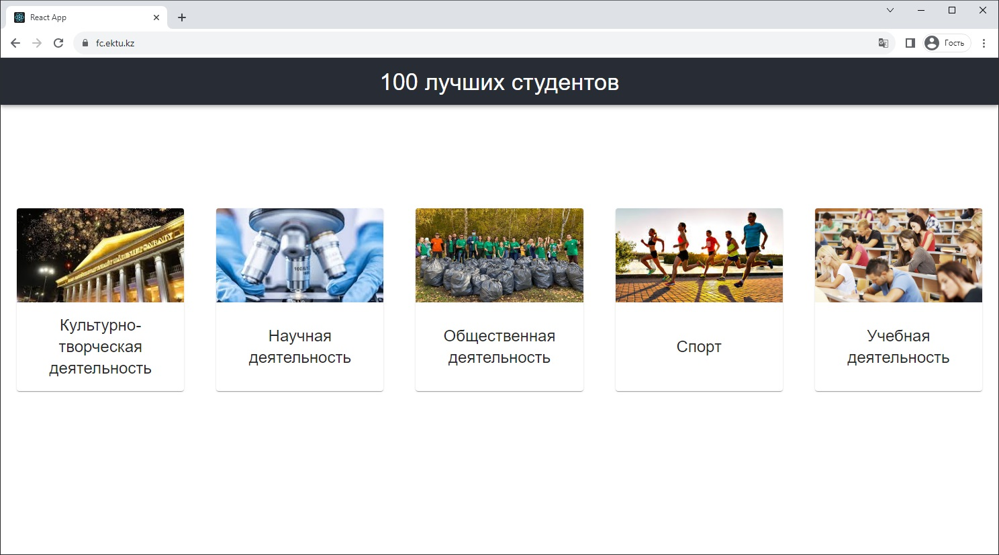

# FutureCrystals2

## Before log in
<div align="center";>
    <a href="https://fc.ektu.kz/">
        
    </a>
</div>

## After log in
<div align="center";>
    <a href="https://fc.ektu.kz/">
        
    </a>
</div>

# Getting started

## Prerequisites
1. Install Node.js. I used version: 18.13.0.

## Installation
1. Clone the repo
```sh
    git clone https://gitlab.ektu.kz/dev-ektu/futureCrystals2.git
   ```
2. Change path
```sh
    cd futureCrystals2/backend
```
3. Install NPM packages(dependencies)
```sh
    npm i
   ```
4. Change path
```sh
    cd ../frontend
```
5. Install NPM packages(dependencies)
```sh
   npm i
   ```
6. Build TypeScript in watch mode
```sh
   npm run devBuild --prefix backend
   ```
<div align="center";>
        
</div>

7. CREATE CONFIG FILE !!!

Input this code in /backend/src/data/conf/config.ts file with your values.
In production sensitive data store in the gitlab variables.
### !!! DON'T REMOVE THIS PATH FROM .gitignore !!!
### !!! DON'T LEAVE SENSITIVE DATA SUCH AS TOKEN AND PASSWORD IN THE CODE !!!
domain: localhost in sessions leave as is, but callback url in creds ask the administrator.

/** 
	/backend/src/data/conf/config.ts - !!!SENSITIVE DATA!!!
	Copyright (C) 2023  Ilya Zhukov <ilyazhukov24@gmail.com>

	This program is free software: you can redistribute it and/or modify
	it under the terms of the GNU General Public License as published by
	the Free Software Foundation, either version 3 of the License, or
	(at your option) any later version.

	This program is distributed in the hope that it will be useful,
	but WITHOUT ANY WARRANTY; without even the implied warranty of
	MERCHANTABILITY or FITNESS FOR A PARTICULAR PURPOSE.  See the
	GNU General Public License for more details.

	You should have received a copy of the GNU General Public License
	along with this program.  If not, see <http://www.gnu.org/licenses/>.

*/
export type Config = {
	PORT: number,
	postgres: typeof postgres,
	sessionOption: typeof sessionOption,
	passportCreds: typeof passportCreds
};
const postgres = {	
	type: "",
	host: "",
	username: "",
	password: "",
	database: "",
	synchronize: true,
	logging: false,
	entities: ["backend/dist/data/models/*.js"]
};
const sessionOption = {
	secret: "",
	cookie: {
		domain: "localhost",
		httpOnly: true,
		maxAge: 3600000,
		path: "/",
		sameSite: "lax"
	},
	name: "session_cookie",
	resave: false,
	rolling: true,
	saveUninitialized:false
};
const PORT = 3500;
const passportCreds = {
	authorizationURL: "",
	tokenURL: "",
	clientID: "",
	callbackURL: "",
	clientSecret: "",
	passReqToCallback: false
};

export const config : Config = {
	PORT: PORT,
	postgres: postgres,
	sessionOption: sessionOption,
	passportCreds: passportCreds
};

8. Press F5 to start server
    Success run
<div align="center";>
    
</div>

9. Run frontend build
```sh
    npm run build --prefix frontend
   ```
<div align="center";>
    
</div>

10. Run frontend server
```sh
    npm run start --prefix frontend
   ```
<div align="center";>
    
</div>

### React will give error. Don't worry!
Go to http://localhost:3500 for authentication

It's ok! Launched server return builded frontend page like in production mode.
<div align="center";>
    
</div>


But using for frontend development http://localhost:3000
<div align="center";>
    
</div>

### Easy deploying
Just create commit and push it in remote origin in GitLab. After that writen code will be move in Docker container. After successful building site will be [available](https://fc.ektu.kz/)

***

## Name
Future Crystals

## Description
- Является второй версией Future Crystals. Она запущена [тут](https://fc.ektu.kz).
- Исходники первой версии можно найти [здесь](https://gitlab.ektu.kz/dev-ektu/futurecrystals). Она запущена [тут](https://services.ektu.kz/futurecrystals).
- Цель данного проекта является сбор файлов от участвующих студентов в определённых направлениях и номинациях, подсчёт голосов и определение победителей в каждом направлении.

## Q & A
1. Почему 100 лучших студентов? 
- Изначально планировалось 5 напрвлений, и в каждом направлении должны были отбираться 20 лучших студентов. Так как в некоторых напрвлениях не набиралось и 20 человек, то активисты сами вручную считали баллы и победителей, опираясь только на файлы грамот и сертификатов. Но когда будет набираться достаточно бОльшее количество студентов, возможно такой функционал автоматического выбора победителей пригодится.
2. Можно поподробней какие процессы происходят в первой версии системы FutureCrystals и какие обязанности программиста?
- Каждый год зимой или весной активисты открывают конкурс на 100 лучших студентов. Для ознакомления можно посмотреть новости сайта ektu.kz.
- При открытии конкурса нужно стереть из [панели оператора](http://services.ektu.kz:715/?nomination=kultura) прошлогодних студентов. Для этого программисту нужно сменить год в SQL запросах. Например с 12-12-2023 на 12-12-2024. Сделать это можно на VM services. Доступ и пароль предоставит администратор. На рабочем столе в папке futurecrystals/futurecrystals_extract в файле server.py необходимо поменять все запросы. Потом, чтобы изменения вступили в силу нужно перезапустить данный сервер. Доступ к базе можно спросить у администратора или других сотрудников.
- На данный момент в первой версии системы FC предполагается просто вручную для каждого студента создать папку с его именем, и в этой папке должны лежать все грамоты этого студента. То есть структура выгрузки за год предполагается следующая Выгрузка->$2023->Направление->$ФИО СТУДЕНТA->Номинация->(файлы). Но можно так же дать активистам ссылку на [панель оператора](http://services.ektu.kz:715/?nomination=kultura).
3. Как будет функционировать вторая версия системы FC?
- Вторая версия системы FC планирутся как более автоматизированная и улучшенная альтернатива первой версии.
- Со стороны студента после перехода по ссылке должна проверяться авторизация данного пользователя. Если пользователь неавторизован (не заходил, протухли куки), его должно редиректить на страницу аутентификации ADFS. За логику по авторизации отвечает файл backend/src/data/passport.ts. После успешного входа на сервере должна производиться проверка открыт ли конкурс в этом году. Если "выбор победителей" или "конкурс завершён", то студенту сообщается что он не может загрузить работы. При статусе конкурса "загрузка работ" студенту грузится список направлений, и он выбирает необходимое. Далее выбирает номинацию и прикрепляет файлы для отправки по данной номинации. Предполагается что студент может загрузить файлы только в одну номинацию. Чтобы загрузить в другие нужно пройти на главную страницу и повторно осуществить загрузку в нужное направление и номинацию.
В хэдере страницы необходимо предусмотреть иконку с фотографией студента, ФИ и кнопкой выхода (как в ADFS реализован выход см. в [Babyland](https://babyland.ektu.kz/))
- Со стороны оператора, который имеет доступ к файлам студентов должна быть возможность при статусе "загрузка работ" просматривать файлы и ставить оценку каждой грамоте и иметь возможность редактировать оценку на случай ошибки. При статусе конкурса "выбор победителей" у оператора появляется кнопка *назначить победителя* рядом с каждым студентом в списке(справа или слева от суммы баллов баллов). При статусе конкурса "конкурс завершён" оператору сообщается что текущий конкурс в этом году уже завершён. И что для открытия конкурса обратитесь к администратору(кабинет, телефон). Каждому оператору предоставляются определённые направления. Интерфейс желательно оформить следующим образом. Сверху страницы в виде вкладок должны быть написаны направления. Заходя в каждую вкладку оператор должен видеть список студентов, которые загрузили работы по данному направлению. В строке с каждым студентом должна отображаться сумма баллов, выровненная по правому краю. Предполагается что изначально, если студент еще не участвовал, то у него по-дефолту 0 и баллы появляются только после одобрения оператором грамоты, или частичного зачёта, либо полного незачёта присланного материала (допустим если одна и та же грамота отправлена дважды и т.п.). Ну и соответственно если у студента несколько грамот, то после оценки оператором каждой - должно быть реализовано суммирование всех баллов для одного студента. Грамоты должны быть расположены под именем студента, подчёркнутого чертой (hr html). Они должны называться как и номинация, но отображаться в виде ссылки. Но the best variant это сделать открытие грамоты в fancybox. Я уверен в реакте что-то похожее можно найти. Рядом со ссылкой должно находиться окошко(input) для ввода баллов с уже проставленной максимальной оценкой по данному направлению. Рядом с инпутом должны располагаться 3 иконки - галочка, карандашик(редактирование) и крестик. Галочка - принять максимальную оценку, карандашик изменить оценку, а крестик - поставить 0 баллов. После оценки > 0 у оператора должна быть возможность редактировать баллы либо отклонить грамоту(0 баллов). Так же если присланный материал отклонён, то должна быть доступна галочка чтобы принять с максимальным количеством баллов грамоту или отредактировать количество баллов.
- Важно отметить, что должен быть реализован список победителей. То есть при выборе студентом напрвления(direction) должна быть выполнена проверка не является ли данный студент победителем в выбранном им напрвлении. Если является, то во все последующие конкурсы он не может подавать заявки в это направление, но может участвовать в других. То есть, если Иванов А С победил в напрвлении спорт в 2023 году, то в 2024 он может участвовать во всех, кроме спорта.
- Пока на первоначальном этапе админ наделён правами создания конкурса и изменении его статуса.
4. Какие статусы могут быть у конкурса?
- 1.Загрузка работ - студенты загружают работы, операторы оценивают;
- 2.Выбор победителей - студенты не могут загружают работы, операторы выбирают победителей в направлении;
- 3.Конкурс завершён - Доступ закрыт для всех, кроме админа; для загрузки новых работ он создаёт новый конкурс на текущий год;
5. Где можно посмотреть на какой стадии проект?
- В файле CHANGELOG есть краткие комментарии об общем продвижении проекта.
Вышеописанные возможности

## Technical Q&A
1. На чём написана система?
- backend на Typescript 
- frontend на React
2. Где точка входа?
- backend - ./backend/src/server.ts
- frontend - ./frontend/src/index.tsx
3. Какая структура папок в backend?
- dist - компилируется с папки src
- node_modules - модули для node.js
- sessions - папка с сессиями пользователей, прошедших авторизацию
- src - папка с файлами проекта.
4. Какая структура папок во frontend?
- Такая же, только сбилденная папка будет называться не dist а build, и для общедоступных файлов - public
5. Какие таблицы для чего нужны? 
- В проекте пока 9 таблиц. Используются не все, но для дальнейшей разработки обязательно пригодятся.
- Contest - таблица хранит конкурсы. Названием конкурса является год. Статус "загрузка работ" устанавливается по умолчанию после создания конкурса. 
- Direction - Содержит направления для конкурса. Помимо названия имеет название изображения(может быть пустым), хранящегося во frontend/public/image. Имеет связь с Nominations 1:N. При удалении записи направления, удаляются все зависимые номинации.
- Nomination - Содержит номинации, к которым уже прикрепляются грамоты.


## Badges
On some READMEs, you may see small images that convey metadata, such as whether or not all the tests are passing for the project. You can use Shields to add some to your README. Many services also have instructions for adding a badge.

## Visuals
Depending on what you are making, it can be a good idea to include screenshots or even a video (you'll frequently see GIFs rather than actual videos). Tools like ttygif can help, but check out Asciinema for a more sophisticated method.


Within a particular ecosystem, there may be a common way of installing things, such as using Yarn, NuGet, or Homebrew. However, consider the possibility that whoever is reading your README is a novice and would like more guidance. Listing specific steps helps remove ambiguity and gets people to using your project as quickly as possible. If it only runs in a specific context like a particular programming language version or operating system or has dependencies that have to be installed manually, also add a Requirements subsection.

## Usage
Use examples liberally, and show the expected output if you can. It's helpful to have inline the smallest example of usage that you can demonstrate, while providing links to more sophisticated examples if they are too long to reasonably include in the README.

## Support
Tell people where they can go to for help. It can be any combination of an issue tracker, a chat room, an email address, etc.

## Roadmap
If you have ideas for releases in the future, it is a good idea to list them in the README.

## Contributing
### Backend package.json scripts:
For example cmd: 
C:\Users\Good Guy\Desktop\FutureCrystals2\backend> npm run start 
1. It command start server(use for test start, but during development use F5 (vsCode launch))
```sh
    npm run start
```
2. Build TypeScript to JavaScript (use for building TS in Docker container, during deployment)
```sh
    npm run build
```
3. Used to start the server, before setting launch.json in .vscode  
```sh
    npm run dev
```
4. Build TypeScript to JavaScript (But with wathcing mode, It's excellent because after changing .ts file, builder recompile files in dist folder and Nodemon(package) seeing file changes restart server)
```sh
    npm run devBuild
```
### Frontend package.json scripts:
For example cmd: 
C:\Users\Good Guy\Desktop\FutureCrystals2\frontend> npm run start 
1. It command start server for development
```sh
    npm run start
```
2. Build React into TypeScript 
```sh
    npm run build
```


## Authors and acknowledgment
Ilya Zhukov <ilyazhukov24@gmail.com> - Main Developer
Dmitry Rylsky - Mentor
Vladimir Krivykh - Admin


## License
GNU GENERAL PUBLIC LICENSE
Version 3, 29 June 2007
Copyright (C) 2007 Free Software Foundation

## Project status
If you have run out of energy or time for your project, put a note at the top of the README saying that development has slowed down or stopped completely. Someone may choose to fork your project or volunteer to step in as a maintainer or owner, allowing your project to keep going. You can also make an explicit request for maintainers.

<sub><sup><b>Easter egg<b></sup></sub>
<sub><sup>Выпьем тост за localhost</sup></sub>
